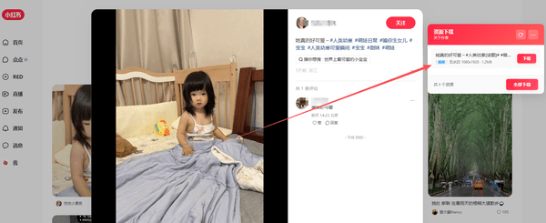
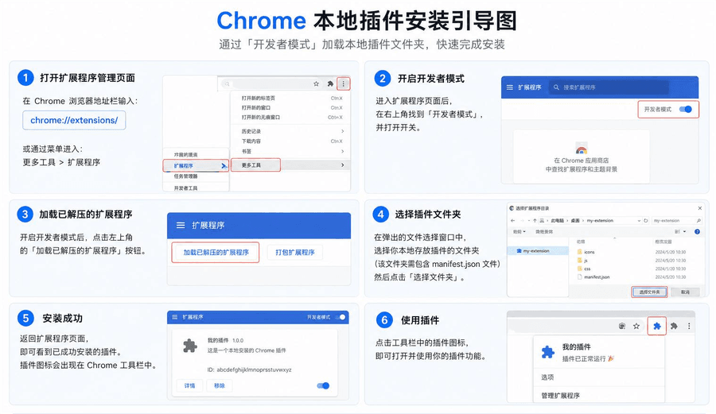

# 豆豆小红书下载器

用于小红书 (`xiaohongshu.com`) 无水印高清原图、无水印视频的捕获、解析与保存。

---

## 🚀 安装与运行扩展 (Chrome / Edge / Brave / 360 等)

1. 打开浏览器扩展管理页面 (例如 Chrome 输入 `chrome://extensions/`)；
2. 开启右上角的 **“开发者模式” (Developer Mode)**；
3. 点击 **“加载已解压的扩展程序” (Load unpacked)**；
4. 选择本插件；
5. 打开 [小红书网页版](https://www.xiaohongshu.com/) 任意笔记或视频详情页，右侧即会自动出现资源下载悬浮球与控制面板！

---

## 社区与交流

| 公众号                                       | QQ群（1095058701）                            |
| -------------------------------------------- | --------------------------------------------- |
|  |  |

---

## 关于作者

[https://www.undsky.com](https://www.undsky.com)
